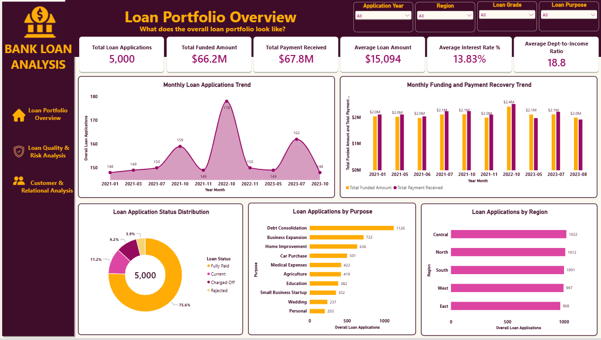
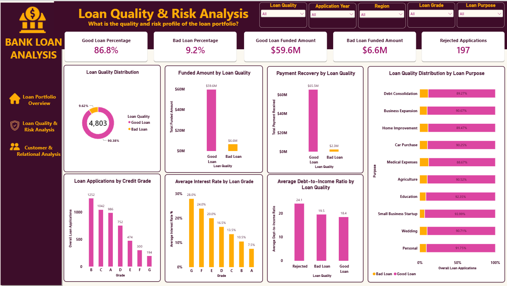
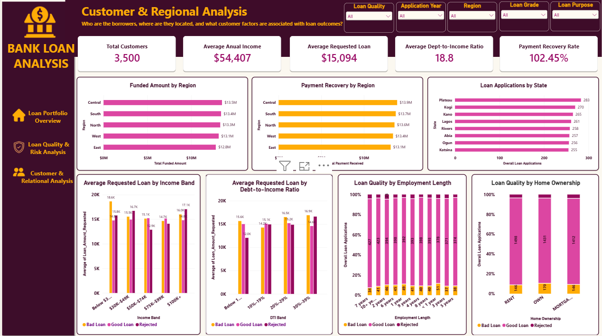

# 📊 Bank Loan Analysis — Power BI Dashboard

## Syntecxhub Data Analysis Internship | Project 1

**Author:** Poweide Abigail Edonkumoh  
**Role:** Entry-Level Data Analyst  
**Internship:** Syntecxhub Data Analysis Internship  
**Project:** Bank Loan Analysis  
**Tool:** Microsoft Power BI  

---

## 📌 Project Overview

This project was completed as part of my **Syntecxhub Data Analysis Internship**.

The Bank Loan Analysis project focuses on analyzing loan applications, funded amounts, repayments, borrower characteristics, and loan quality. The analysis was developed using **Power Query, DAX, and Power BI** to transform raw loan data into an interactive three-page dashboard.

The dashboard provides insights into:

- Loan application volume
- Requested and funded loan amounts
- Payment recovery
- Loan status and quality
- Credit grades
- Interest rates
- Debt-to-income ratios
- Regional and state-level activity
- Customer and borrower characteristics
- Loan purpose patterns

The project follows the requirements of the Syntecxhub Bank Loan Analysis task, which includes calculating key loan KPIs, classifying loans, performing trend analysis, identifying factors related to loan outcomes, and building a Power BI dashboard. :contentReference[oaicite:0]{index=0}

---

# 🎯 Project Objectives

The main objectives of this project were to:

1. Analyze bank loan applications, funding, and repayment activity.
2. Calculate key performance indicators (KPIs).
3. Classify loans into **Good Loans, Bad Loans, and Rejected Applications**.
4. Analyze loan trends over time.
5. Examine loan activity across regions and states.
6. Analyze borrower characteristics and loan purposes.
7. Identify patterns associated with loan quality and repayment.
8. Build an interactive Power BI dashboard for business-oriented insights.

---

# 📂 Dataset Overview

The dataset contains **5,000 loan records** across **21 fields**, representing loan applications and borrower information.

### Dataset Statistics

| Metric | Value |
|---|---:|
| Loan Records | 5,000 |
| Unique Customers | 3,500 |
| Columns | 21 |
| Application Period | 2021–2023 |
| Unique Loan IDs | 5,000 |

### Key Data Categories

**Loan Activity**
- Application Date
- Issue Date
- Last Payment Date

**Financial Information**
- Loan Amount Requested
- Funded Amount
- Funded Amount Investors
- Total Payment Received
- Annual Income

**Risk & Loan Characteristics**
- Loan Grade
- Interest Rate
- Term
- Loan Status
- Debt-to-Income Ratio (DTI)

**Borrower Information**
- Employment Length
- Home Ownership
- Customer ID

**Segmentation**
- Loan Purpose
- Region
- State

> **Important:** Customer IDs are not unique because a customer can have multiple loans. `Loan_ID` was therefore used as the unique loan-level identifier for duplicate checks.

---

# 🧹 Data Cleaning & Preparation

Data preparation was completed using **Power Query in Power BI** before creating the dashboard.

### Cleaning Steps

- Reviewed column quality, distribution, and profile.
- Assigned appropriate data types to all columns.
- Cleaned and trimmed text fields.
- Checked for missing values and errors.
- Checked for duplicate records.
- Confirmed **5,000 unique Loan IDs**.
- Confirmed there were no duplicate complete rows.
- Created additional date fields for time-based analysis.

### Date Fields Created

- Application Year
- Application Month
- Application Month Number
- Application Year-Month

### Missing Date Handling

`Issue_Date` and `Last_Payment_Date` contained missing values for rejected applications.

These records were retained rather than deleted or assigned artificial dates because rejected applications did not progress through the loan issuance and repayment stages.

---

# 🧮 Loan Quality Classification

Loans were classified based on their recorded loan status.

| Loan Status | Loan Quality |
|---|---|
| Fully Paid | Good Loan |
| Current | Good Loan |
| Charged Off | Bad Loan |
| Rejected | Rejected |

Rejected applications were kept as a separate category rather than forcing them into the Good Loan or Bad Loan classification.

---

# 📐 Key KPIs

The dashboard calculates and displays several important loan performance indicators.

### Portfolio KPIs

- Total Loan Applications
- Total Funded Amount
- Total Payment Received
- Average Loan Amount
- Average Interest Rate
- Average Debt-to-Income Ratio

### Loan Quality KPIs

- Rejected Applications
- Good Loan Percentage
- Bad Loan Percentage
- Good Loan Funded Amount
- Bad Loan Funded Amount

### Customer & Regional Analysis KPIs

- Total Customers
- Average Anual Income
- Average Requested Loan
- Average Dept-to-Income Ratio
- Payment Recovery Rate

---

# 📊 Dashboard Structure

The final Power BI dashboard consists of **three interactive pages**.

## 1️⃣ Loan Portfolio Overview

This page provides an executive-level overview of the loan portfolio.

### Key Areas

- Total loan applications
- Total funded amount
- Total payments received
- Average loan amount
- Average interest rate
- Average Dept-to-Income Ratio
- Monthly application trends
- Monthly funding and payment trends
- Loan status distribution
- Loan applications by purpose
- Loan applications by region

---

## 2️⃣ Loan Quality & Risk Analysis

This page focuses on loan outcomes and risk-related patterns.

### Key Areas

- Good vs Bad loan distribution
- Funded amount by loan quality
- Payment recovery by loan quality
- Loan applications by credit grade
- Average interest rate by grade
- Average DTI (Dept-to-Income Ratio) by loan quality
- Loan quality Distribution by loan purpose
- Rejected applications

Among non-rejected loans, **86.8% were classified as Good Loans and 9.2% as Bad Loans** based on the dashboard classification.

---

## 3️⃣ Customer & Regional Analysis

This page focuses on borrower characteristics and geographical patterns.

### Key Areas

- Total customers
- Average annual income
- Average requested loan
- Payment recovery rate
- Funded amount by region
- Payment recovery by region
- Loan applications by state
- Average Requested Loan by Income Band
- Average Requested Loan by Dept-to-Income Ratio
- Loan Quality by Employment length
- Loan Quality by Home ownership

---

# 🖼️ Dashboard Preview

> **Upload your three dashboard screenshots to the `Dashboard` folder in this repository and use the image links below.**

## Page 1 — Loan Portfolio Overview



---

## Page 2 — Loan Quality & Risk Analysis



---

## Page 3 — Customer & Regional Analysis



---

# 🔍 Key Insights

### Portfolio

- The dataset contains **5,000 loan applications** from **3,500 unique customers**.
- Approximately **$66.2M** was funded.
- Recorded payments total approximately **$67.8M**.
- The average requested loan amount is approximately **$15.09K**.

### Loan Status

- Fully Paid loans represent the largest loan-status category.
- Current loans form another significant portion of the portfolio.
- Charged Off loans represent a smaller but important risk segment.
- Rejected applications are analyzed separately from Good and Bad Loans.

### Risk

- Among non-rejected loans, Good Loans represent **86.8%**, while Bad Loans represent **9.2%**.
- Credit grade, interest rate, and DTI provide complementary views of loan risk.
- The dashboard allows loan quality to be compared across different loan purposes.

### Loan Purpose

- **Debt Consolidation** has the highest application volume among the loan purposes analyzed.

### Regional Analysis

- Loan applications, funding, and payment activity were compared across regions and states to identify differences in portfolio activity.

---

# 🛠️ Tools & Technologies

The following tools and techniques were used throughout the project:

- **Microsoft Power BI**
- **Power Query**
- **DAX**
- **Data Cleaning**
- **Data Transformation**
- **Data Modeling**
- **KPI Development**
- **Data Visualization**
- **Trend Analysis**
- **Risk Analysis**
- **Customer Analysis**
- **Regional Analysis**
- **Business Intelligence**

---

# 📁 Repository Structure

```text
Syntecxhub_Bank_Loan_Analysis/
│
├── README.md
│
├── Dataset/
│   └── bank_loan_dataset.csv
│
├── PowerBI/
│   └── Syntecxhub_Bank_Loan_Analysis.pbix
│
├── Dashboard/
│   ├── Loan_Portfolio_Overview.png
│   ├── Loan_Quality_Risk_Analysis.png
│   └── Customer_Regional_Analysis.png
│
└── Presentation/
    └── Syntecxhub_Bank_Loan_Analysis_Presentation.pptx
